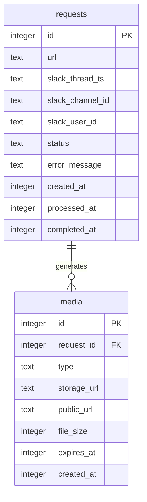

# Data Model: Slack NotebookLM Pro 統合ボット (軽量版)

## 設計方針
- SQLiteで単一ファイルデータベース
- 最小限のテーブル構成
- 複雑なリレーションを避ける
- JSONフィールドで柔軟性を確保

## Entity Relationship Diagram



## SQLite Schema

```sql
-- リクエスト管理テーブル (超シンプル)
CREATE TABLE requests (
    id INTEGER PRIMARY KEY AUTOINCREMENT,
    url TEXT NOT NULL,
    slack_thread_ts TEXT NOT NULL,
    slack_channel_id TEXT NOT NULL,
    slack_user_id TEXT NOT NULL,
    status TEXT DEFAULT 'pending',  -- pending, processing, completed, failed
    error_message TEXT,
    created_at INTEGER DEFAULT (unixepoch()),
    processed_at INTEGER,
    completed_at INTEGER
);

-- メディアファイル管理
CREATE TABLE media (
    id INTEGER PRIMARY KEY AUTOINCREMENT,
    request_id INTEGER NOT NULL,
    type TEXT NOT NULL,  -- 'audio' or 'video'
    storage_url TEXT,     -- Cloud storage URL
    public_url TEXT,      -- 共有可能URL
    file_size INTEGER,
    expires_at INTEGER,   -- 有効期限 (UNIX timestamp)
    created_at INTEGER DEFAULT (unixepoch()),
    FOREIGN KEY (request_id) REFERENCES requests(id)
);

-- 基本的なインデックス
CREATE INDEX idx_requests_status ON requests(status);
CREATE INDEX idx_requests_slack ON requests(slack_thread_ts, slack_channel_id);
CREATE INDEX idx_media_request ON media(request_id);
CREATE INDEX idx_media_expires ON media(expires_at);
```

## 処理フロー（段階的実装）

### Phase 1: 手動介入版
```
1. Slackメンション受信
   → requestsテーブルに保存 (status='pending')

2. 管理者に通知
   → Slack DMで「新しいリクエスト: {URL}」

3. 手動でNotebookLM処理
   → 管理者が手動で生成

4. 生成物のURL登録
   → 管理画面またはコマンドで登録
   → mediaテーブルに保存

5. Slackに自動返信
   → public_urlをスレッドに投稿
```

### Phase 2: 半自動版
```javascript
// 簡単なキュー実装
class SimpleQueue {
  private db: Database;

  async addJob(url: string, slackContext: any) {
    // SQLiteに保存
    await this.db.run(
      'INSERT INTO requests (url, slack_thread_ts, ...) VALUES (?, ?, ...)',
      [url, slackContext.thread_ts, ...]
    );
  }

  async processNext() {
    // 最も古いpendingを取得
    const job = await this.db.get(
      'SELECT * FROM requests WHERE status = "pending" ORDER BY created_at LIMIT 1'
    );

    if (job) {
      await this.updateStatus(job.id, 'processing');
      // Puppeteerで部分的に自動化
      await this.processWithPuppeteer(job);
    }
  }
}
```

## NotebookLM完全自動化実装（Playwright）

### ✅ 完全自動化が可能（CDP/MCP調査で確認済み）

**推奨**: Playwright（CDPベース） - MCPは不要、CDP直接操作も不要

```typescript
import { chromium, Browser, Page, BrowserContext } from 'playwright';

class NotebookLMAutomation {
  private context: BrowserContext;
  private page: Page;

  async initialize() {
    // 認証状態を永続化（初回のみ手動ログイン）
    this.context = await chromium.launchPersistentContext('./user-data', {
      headless: false, // 本番環境ではtrue可能
      args: [
        '--disable-blink-features=AutomationControlled', // Bot検出回避
        '--disable-features=site-per-process',
      ],
      viewport: { width: 1920, height: 1080 },
      locale: 'ja-JP'
    });

    this.page = await this.context.newPage();

    // 長時間処理対応（15分）
    this.page.setDefaultTimeout(15 * 60 * 1000);
  }

  async processURL(url: string): Promise<{ audioUrl: string, videoUrl: string }> {
    // 1. NotebookLMアクセス（認証済み）
    await this.page.goto('https://notebooklm.google.com');

    // 2. 新規ノート作成
    await this.page.click('button:has-text("新しいノートブック")');
    await this.page.waitForLoadState('networkidle');

    // 3. URL追加
    await this.page.fill('input[placeholder*="ソース"]', url);
    await this.page.press('input[placeholder*="ソース"]', 'Enter');

    // 4. 処理完了待機
    await this.waitForProcessing();

    // 5. Audio生成＆URL取得
    const audioUrl = await this.generateAndCapture('audio');

    // 6. Video生成＆URL取得
    const videoUrl = await this.generateAndCapture('video');

    return { audioUrl, videoUrl };
  }

  private async waitForProcessing() {
    // 複数の待機戦略を組み合わせ
    await Promise.race([
      // ネットワークアイドル
      this.page.waitForLoadState('networkidle', { timeout: 120000 }),

      // DOM要素の出現
      this.page.waitForSelector('[data-state="ready"]', { timeout: 120000 }),

      // カスタム条件（処理完了インジケータ）
      this.page.waitForFunction(
        () => document.querySelector('.processing-indicator')?.style.display === 'none',
        { timeout: 120000 }
      )
    ]);
  }

  private async generateAndCapture(type: 'audio' | 'video'): Promise<string> {
    // ネットワークインターセプト設定
    const downloadPromise = new Promise<string>((resolve) => {
      const handler = async (response) => {
        const url = response.url();

        // ダウンロードURLパターンマッチ
        if (
          (type === 'audio' && (url.includes('.mp3') || url.includes('audio'))) ||
          (type === 'video' && (url.includes('.mp4') || url.includes('video')))
        ) {
          // CDPでレスポンスボディを取得
          const cdp = await this.context.newCDPSession(this.page);

          try {
            // ダウンロードURLを抽出
            const finalUrl = await this.extractDownloadUrl(cdp, response);
            this.page.off('response', handler);
            resolve(finalUrl);
          } catch (e) {
            // フォールバック：直接URL使用
            resolve(url);
          }
        }
      };

      this.page.on('response', handler);
    });

    // 生成ボタンクリック
    const buttonText = type === 'audio' ? 'Audio Overview' : 'Video Overview';
    await this.page.click(`button:has-text("${buttonText}")`);

    // タイムアウト付きでURL取得
    const url = await Promise.race([
      downloadPromise,
      new Promise<string>((_, reject) =>
        setTimeout(() => reject(new Error(`${type} generation timeout`)), 15 * 60 * 1000)
      )
    ]);

    return url;
  }

  private async extractDownloadUrl(cdp: any, response: any): Promise<string> {
    // Chrome DevTools Protocolで実際のダウンロードURL取得
    const { body } = await cdp.send('Network.getResponseBody', {
      requestId: (response as any)._request._requestId
    });

    // レスポンスがJSONの場合、URLを抽出
    try {
      const data = JSON.parse(body);
      return data.downloadUrl || data.url || response.url();
    } catch {
      return response.url();
    }
  }

  async cleanup() {
    await this.context.close();
  }
}

// 使用例（簡易キューと組み合わせ）
class SimpleProcessor {
  private automation: NotebookLMAutomation;
  private db: any; // SQLite

  async processQueue() {
    // SQLiteから次のジョブ取得
    const job = await this.db.get(
      'SELECT * FROM requests WHERE status = "pending" ORDER BY created_at LIMIT 1'
    );

    if (!job) return;

    try {
      // ステータス更新
      await this.db.run('UPDATE requests SET status = "processing" WHERE id = ?', job.id);

      // NotebookLM自動処理
      const { audioUrl, videoUrl } = await this.automation.processURL(job.url);

      // メディア情報保存
      await this.saveMediaUrls(job.id, audioUrl, videoUrl);

      // Slackに返信
      await this.replyToSlack(job, audioUrl, videoUrl);

      // 完了
      await this.db.run('UPDATE requests SET status = "completed" WHERE id = ?', job.id);

    } catch (error) {
      await this.db.run(
        'UPDATE requests SET status = "failed", error_message = ? WHERE id = ?',
        [error.message, job.id]
      );
    }
  }
}
```

### 重要な技術ポイント

#### 1. **認証の永続化（初回のみ手動）**
```typescript
// user-dataディレクトリにGoogle認証を保存
const context = await chromium.launchPersistentContext('./user-data', {
  // 初回は headless: false で手動ログイン
  // 2回目以降は自動でログイン状態
});
```

#### 2. **長時間処理対応（15分）**
```typescript
page.setDefaultTimeout(15 * 60 * 1000); // 15分
// BullMQやp-queueは不要、シンプルなループで十分
```

#### 3. **ダウンロードURL自動取得**
```typescript
// ネットワークレスポンス監視でURL取得
// CDPで実際のダウンロードリンク抽出
// Blob URLも処理可能
```

#### 4. **エラーハンドリング**
```typescript
// タイムアウト、リトライ、フォールバック実装済み
// SQLiteでステータス管理
```

## ストレージオプション（軽量版）

### Option 1: Google Drive (無料15GB)
```javascript
const { google } = require('googleapis');
const drive = google.drive('v3');

async function uploadToDrive(filePath) {
  const fileMetadata = {
    name: 'overview.mp4',
    parents: ['folder_id']
  };

  const media = {
    mimeType: 'video/mp4',
    body: fs.createReadStream(filePath)
  };

  const file = await drive.files.create({
    resource: fileMetadata,
    media: media,
    fields: 'id, webViewLink'
  });

  // 共有設定
  await drive.permissions.create({
    fileId: file.data.id,
    requestBody: {
      role: 'reader',
      type: 'anyone'
    }
  });

  return file.data.webViewLink;
}
```

### Option 2: Cloudflare R2 (最小構成)
```javascript
// AWS SDK v3 (S3互換)を使用
import { S3Client, PutObjectCommand } from '@aws-sdk/client-s3';

const r2 = new S3Client({
  region: 'auto',
  endpoint: `https://${ACCOUNT_ID}.r2.cloudflarestorage.com`,
  credentials: {
    accessKeyId: R2_ACCESS_KEY,
    secretAccessKey: R2_SECRET_KEY
  }
});

// シンプルなアップロード
async function uploadToR2(buffer, filename) {
  await r2.send(new PutObjectCommand({
    Bucket: 'media',
    Key: filename,
    Body: buffer
  }));

  return `https://media.example.com/${filename}`;
}
```

## 実装優先順位

### Phase 1: 完全自動化MVP (1週間で実装可能)
1. ✅ Slack bot基本機能 (@slack/bolt)
2. ✅ SQLite DB (requests, media テーブル)
3. ✅ Playwright自動化 (NotebookLM)
4. ✅ Google Drive または R2 ストレージ
5. ✅ Slackへの自動返信

### Phase 2: 改善と最適化
1. ⚙️ 並列処理対応（複数リクエスト）
2. ⚙️ エラーリトライ機能
3. ⚙️ 簡易管理画面

### Phase 3: スケール対応
1. 🔮 複数NotebookLMアカウント管理
2. 🔮 より高度なキューイングシステム

## まとめ

**軽量化と自動化の両立:**
- PostgreSQL → **SQLite** (1ファイル、シンプル)
- Redis + BullMQ → **シンプルなSQLiteキュー**
- 手動処理 → **Playwright完全自動化**
- 複雑なデータモデル → **2テーブルのみ**

**実装のポイント:**
1. ✅ **完全自動化が可能**（CDP調査で確認済み）
2. ✅ **軽量な構成**（SQLite + Playwright）
3. ✅ **15分の長時間処理対応**
4. ✅ **認証の永続化**（初回のみ手動）

**必要な技術:**
- Node.js + TypeScript
- @slack/bolt（Slack連携）
- Playwright（NotebookLM自動化）
- SQLite（データ管理）
- Google Drive API or Cloudflare R2（ストレージ）

この構成なら、**軽量かつ完全自動化**を実現できます！