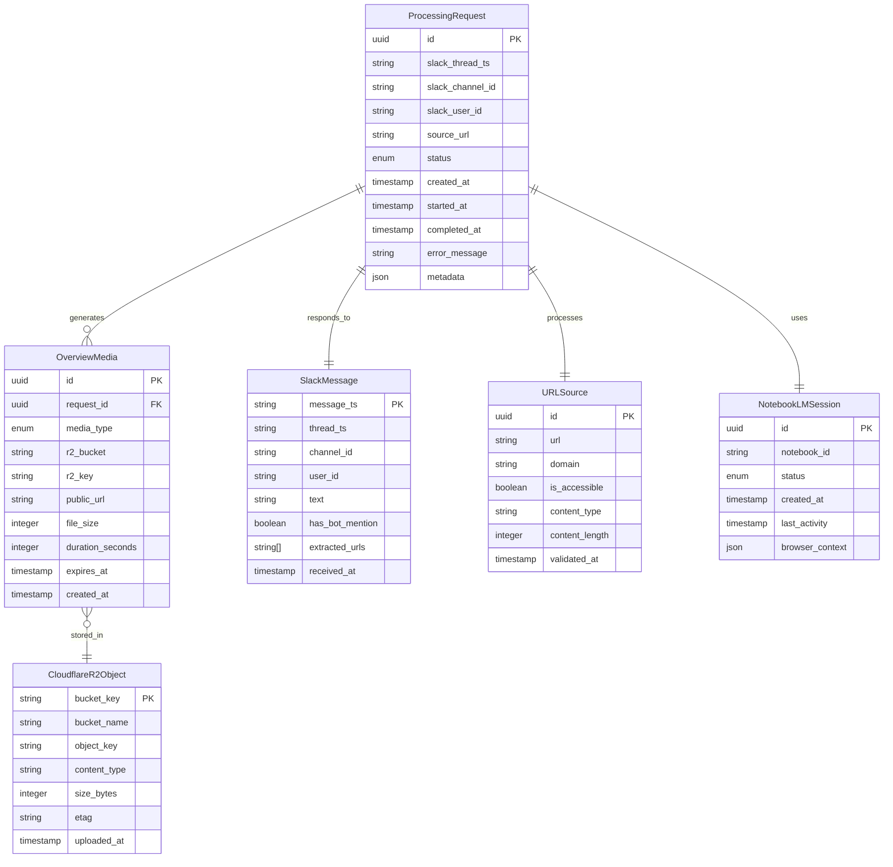

# Data Model: Slack NotebookLM Pro 統合ボット

## Entity Relationship Diagram



## Entity Definitions

### ProcessingRequest
Central entity tracking the lifecycle of a user request from Slack mention to completion.

**Fields:**
- `id` (UUID): Unique identifier for the request
- `slack_thread_ts` (string): Slack thread timestamp for context
- `slack_channel_id` (string): Channel where request originated
- `slack_user_id` (string): User who triggered the request
- `source_url` (string): URL to be processed
- `status` (enum): Current processing status
  - Values: `pending`, `queued`, `processing`, `uploading`, `completed`, `failed`
- `created_at` (timestamp): When request was received
- `started_at` (timestamp, nullable): When processing began
- `completed_at` (timestamp, nullable): When processing finished
- `error_message` (string, nullable): Error details if failed
- `metadata` (JSON): Additional context (retry count, etc.)

**Validation Rules:**
- URL must be valid HTTP/HTTPS
- Status transitions must be valid (pending → queued → processing → uploading → completed/failed)

### SlackMessage
Represents incoming Slack messages and extracted context.

**Fields:**
- `message_ts` (string): Unique Slack message timestamp (primary key)
- `thread_ts` (string): Thread timestamp (same as message_ts if thread starter)
- `channel_id` (string): Slack channel ID
- `user_id` (string): Slack user ID who sent message
- `text` (string): Raw message text
- `has_bot_mention` (boolean): Whether bot was mentioned
- `extracted_urls` (string[]): All URLs found in message
- `received_at` (timestamp): When message was received

**Validation Rules:**
- Must have at least one URL if has_bot_mention is true
- Channel ID must match configured allowed channels

### URLSource
Validated URL ready for NotebookLM processing.

**Fields:**
- `id` (UUID): Unique identifier
- `url` (string): Validated URL
- `domain` (string): Extracted domain for analytics
- `is_accessible` (boolean): Whether URL returns 200 OK
- `content_type` (string, nullable): MIME type if detected
- `content_length` (integer, nullable): Content size in bytes
- `validated_at` (timestamp): When validation occurred

**Validation Rules:**
- URL must be publicly accessible (no auth required)
- Content type should be text/html or compatible

### NotebookLMSession
Tracks browser automation session with NotebookLM Pro.

**Fields:**
- `id` (UUID): Session identifier
- `notebook_id` (string, nullable): NotebookLM notebook ID if created
- `status` (enum): Session status
  - Values: `initializing`, `authenticated`, `active`, `completed`, `expired`
- `created_at` (timestamp): Session start time
- `last_activity` (timestamp): Last successful action
- `browser_context` (JSON): Serialized browser state for recovery

**State Transitions:**
- initializing → authenticated → active → completed
- Any state → expired (after timeout)

### OverviewMedia
Generated audio/video summary files and their metadata.

**Fields:**
- `id` (UUID): Media identifier
- `request_id` (UUID): Link to parent ProcessingRequest
- `media_type` (enum): Type of media
  - Values: `audio`, `video`
- `r2_bucket` (string): Cloudflare R2 bucket name
- `r2_key` (string): Object key in bucket
- `public_url` (string): Shareable URL
- `file_size` (integer): Size in bytes
- `duration_seconds` (integer, nullable): Media duration
- `expires_at` (timestamp): When URL expires (7 days from creation)
- `created_at` (timestamp): When uploaded

**Validation Rules:**
- Both audio and video must be generated per request
- URLs expire after 7 days
- File size limits: Audio < 100MB, Video < 500MB

### CloudflareR2Object
Metadata for objects stored in Cloudflare R2.

**Fields:**
- `bucket_key` (string): Composite key (bucket:object_key)
- `bucket_name` (string): R2 bucket name
- `object_key` (string): Object path within bucket
- `content_type` (string): MIME type
- `size_bytes` (integer): File size
- `etag` (string): Entity tag for caching
- `uploaded_at` (timestamp): Upload timestamp

## Indexes

### PostgreSQL Indexes
```sql
-- ProcessingRequest
CREATE INDEX idx_processing_request_status ON processing_request(status);
CREATE INDEX idx_processing_request_slack_thread ON processing_request(slack_thread_ts, slack_channel_id);
CREATE INDEX idx_processing_request_created ON processing_request(created_at DESC);

-- SlackMessage
CREATE UNIQUE INDEX idx_slack_message_ts ON slack_message(message_ts);
CREATE INDEX idx_slack_message_thread ON slack_message(thread_ts);

-- OverviewMedia
CREATE INDEX idx_overview_media_request ON overview_media(request_id);
CREATE INDEX idx_overview_media_expires ON overview_media(expires_at);

-- CloudflareR2Object
CREATE INDEX idx_r2_object_bucket ON cloudflare_r2_object(bucket_name);
```

## Data Lifecycle

### Request Processing Flow
1. **Message Received**: SlackMessage created with extracted URLs
2. **Request Created**: ProcessingRequest in `pending` status
3. **URL Validated**: URLSource created after accessibility check
4. **Session Started**: NotebookLMSession created for browser automation
5. **Processing**: Status moves through states as notebook processes
6. **Media Generated**: OverviewMedia records created for audio/video
7. **Storage**: CloudflareR2Object records for uploaded files
8. **Completion**: ProcessingRequest marked `completed` with URLs

### Data Retention
- **ProcessingRequest**: Retain for 30 days for analytics
- **SlackMessage**: Retain for 7 days for debugging
- **URLSource**: Retain for 30 days for duplicate detection
- **NotebookLMSession**: Clear after 24 hours (security)
- **OverviewMedia**: Retain metadata for 30 days (files for 7 days)
- **CloudflareR2Object**: Purge after 7 days with lifecycle rules

### Cleanup Jobs
- Daily: Remove expired NotebookLMSession records
- Daily: Delete CloudflareR2Object and files older than 7 days
- Weekly: Archive completed ProcessingRequest older than 30 days
- Weekly: Clean SlackMessage older than 7 days

## Concurrency Considerations

### Locking Strategy
- Use PostgreSQL row-level locks for request processing
- Redis distributed locks for NotebookLM account access
- Optimistic locking for status transitions

### Queue Management
- BullMQ handles job concurrency limits
- Max 1 concurrent NotebookLM session (account limit)
- Max 100 concurrent R2 uploads
- Automatic retry with exponential backoff