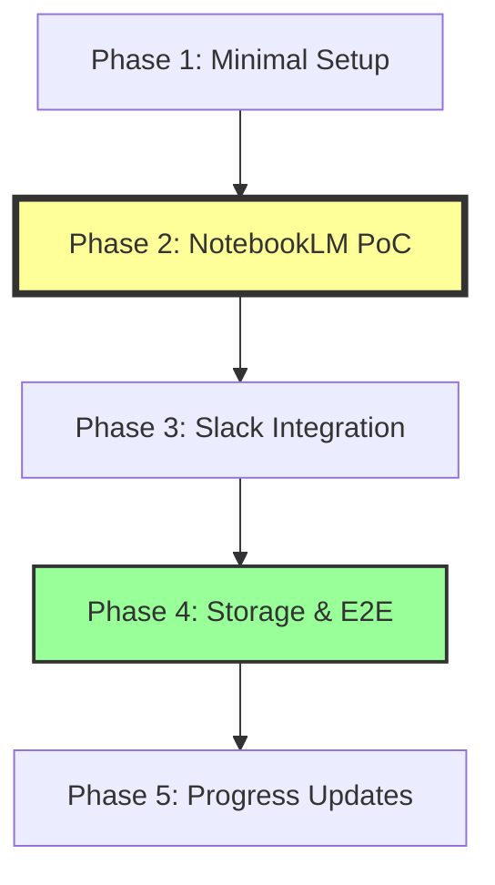

# Implementation Tasks: Slack NotebookLM Pro 統合ボット (軽量版)

**Feature**: Slack NotebookLM Pro 統合ボット
**Branch**: `001-slack-url-notebooklm`
**Stack**: Node.js 20+, TypeScript 5.x, @slack/bolt, Playwright, SQLite3, AWS SDK v3 (R2)

## Summary

Total tasks: 38 (reorganized for NotebookLM-first approach)
- **Phase 1: Minimal Setup** - 5 tasks - Quick start
- **Phase 2: NotebookLM Automation PoC** - 9 tasks - **最優先: Audio/Video生成を証明**
- **Phase 3: Slack Integration** - 8 tasks - Botからの呼び出し
- **Phase 4: Storage & E2E** - 10 tasks - R2とフル統合
- **Phase 5: Progress Updates (P2)** - 6 tasks - オプション機能

**実装戦略**: NotebookLMへのURL投げ込み→Audio/Video生成を最初に検証
**MVP Scope**: Phase 1-2 (NotebookLM automation proof of concept)

## Phase 1: Minimal Project Setup

### Objective
最小限のセットアップでPlaywright実験を開始できるようにする

### Tasks

**T001** - Initialize Node.js project with TypeScript [Setup]
- File: `package.json`, `tsconfig.json`
- Create new Node.js project with TypeScript configuration
- Install: typescript, @types/node, tsx

**T002** - Install Playwright only [Setup]
- File: `package.json`
- Install: playwright, @playwright/test
- Run: npx playwright install chromium

**T003** - Create minimal project structure [Setup] [P]
- Files: `src/`, `tests/`, `user-data/`, `.env`
- Add .gitignore for user-data/, .env
- Create basic directory structure

**T004** - Setup basic logging [Setup] [P]
- File: `src/lib/logger.ts`
- Simple console logger with timestamps
- Can upgrade to winston later

**T005** - Create environment config [Setup] [P]
- File: `src/lib/config.ts`, `.env.example`
- Only NotebookLM-related vars for now
- PLAYWRIGHT_HEADLESS, NOTEBOOKLM_EMAIL

---
**Checkpoint**: Ready to start Playwright automation experiments

## Phase 2: NotebookLM Automation PoC

### Objective
**最優先**: URLをNotebookLMに投げ込んでAudio/Videoが生成できることを検証

### Tasks

**T006** - Setup Playwright browser with persistent context [NotebookLM-PoC]
- File: `src/services/notebooklm-automation.ts`
- Initialize chromium.launchPersistentContext
- Configure user-data directory for auth persistence
- Set headless mode from config

**T007** - Implement manual login helper script [NotebookLM-PoC]
- File: `scripts/manual-login.ts`
- Open browser to notebooklm.google.com
- Wait for user to login manually
- Save session to user-data/
- Script exits after successful login

**T008** - Create notebook creation automation [NotebookLM-PoC]
- File: `src/services/notebooklm-automation.ts` (part 2)
- Navigate to NotebookLM (using saved auth)
- Click "新しいノートブック" button
- Wait for notebook page load

**T009** - Implement URL source addition [NotebookLM-PoC]
- File: `src/services/notebooklm-automation.ts` (part 3)
- Find and fill source input field
- Submit URL as source
- Wait for processing completion indicators

**T010** - Implement Audio Overview generation [NotebookLM-PoC]
- File: `src/services/notebooklm-automation.ts` (part 4)
- Click Audio Overview button
- Setup network response interceptor
- Capture download URL from network traffic
- Handle 15-minute timeout

**T011** - Implement Video Overview generation [NotebookLM-PoC]
- File: `src/services/notebooklm-automation.ts` (part 5)
- Click Video Overview button
- Intercept video download URL
- Handle generation timeout

**T012** - Create standalone test script [NotebookLM-PoC]
- File: `scripts/test-notebooklm.ts`
- Take URL from command line args
- Run full automation flow
- Output audio/video URLs to console
- This proves the core automation works!

**T013** - Add error handling and retries [NotebookLM-PoC]
- File: `src/services/notebooklm-automation.ts` (enhancement)
- Timeout handling for long operations
- Retry logic for network failures
- Screenshot on errors

**T014** - Document NotebookLM automation findings [NotebookLM-PoC] [P]
- File: `docs/notebooklm-automation.md`
- Document UI element selectors found
- Note timing observations
- Record error cases encountered

---
**Checkpoint**: ✅ NotebookLM automation proven - Can generate Audio/Video from URL!

## Phase 3: Slack Integration

### Objective
NotebookLM自動化が動いたので、次はSlackと接続する

### Tasks

**T015** - Install Slack dependencies [Slack]
- File: `package.json`
- Install: @slack/bolt, @slack/web-api
- Install dotenv if not already installed

**T016** - Setup Slack app configuration [Slack]
- File: `src/lib/config.ts` (enhancement)
- Add SLACK_BOT_TOKEN, SLACK_APP_TOKEN
- Add Slack-related environment variables

**T017** - Implement Slack bot initialization [Slack]
- File: `src/services/slack-bot.ts`
- Initialize Slack App with Socket Mode
- Setup event listeners for app_mention events
- Add connection error handling

**T018** - Create URL extraction service [Slack] [P]
- File: `src/services/url-extractor.ts`
- Extract URLs from Slack message text
- Validate URL format
- Return first valid URL found

**T019** - Implement basic Slack event handler [Slack]
- File: `src/services/slack-bot.ts` (enhancement)
- Handle app_mention events
- Extract URL from message
- Send acknowledgment reply

**T020** - Create manual Slack integration test [Slack]
- File: `scripts/test-slack.ts`
- Connect to Slack workspace
- Listen for mentions
- Log events to console
- Verify bot responds to mentions

**T021** - Add simple message formatting [Slack] [P]
- File: `src/services/slack-bot.ts` (enhancement)
- Format bot replies with blocks
- Add emoji and formatting
- Create error message templates

**T022** - Implement thread reply functionality [Slack]
- File: `src/services/slack-bot.ts` (enhancement)
- Reply to correct thread using thread_ts
- Maintain conversation context
- Handle DMs vs channels

---
**Checkpoint**: ✅ Slack bot responds to mentions and extracts URLs

## Phase 4: Storage & End-to-End Integration

### Objective
R2ストレージ追加とSlack→NotebookLM→R2→Slackの全体フロー完成

### Tasks

**T023** - Install storage dependencies [Storage]
- File: `package.json`
- Install: @aws-sdk/client-s3
- Install: sqlite3, @types/better-sqlite3

**T024** - Setup Cloudflare R2 client [Storage]
- File: `src/services/cloudflare-storage.ts`
- Initialize S3 client with R2 endpoint
- Configure authentication from environment
- Add bucket configuration

**T025** - Implement media file download from URLs [Storage]
- File: `src/services/cloudflare-storage.ts` (part 2)
- Download audio/video from NotebookLM URLs
- Stream to memory or temp file
- Handle large file downloads

**T026** - Implement R2 upload with public URLs [Storage]
- File: `src/services/cloudflare-storage.ts` (part 3)
- Upload media to R2 bucket
- Generate public URLs with 7-day expiration
- Return shareable links

**T027** - Create SQLite database and schema [Storage]
- Files: `src/lib/database.ts`, `src/db/migrations/001_initial.sql`
- Setup SQLite connection with better-sqlite3
- Create requests and media tables
- Add indexes for performance

**T028** - Implement simple queue service [Storage]
- File: `src/services/simple-queue.ts`
- SQLite-based queue (pending/processing/completed)
- Add job, get next, update status methods
- Serial processing (one at a time)

**T029** - Create request processor orchestrator [Integration]
- File: `src/services/request-processor.ts`
- Coordinate: Queue → NotebookLM → R2 → Slack
- Handle end-to-end error recovery
- Update database status at each step

**T030** - Integrate all services in Slack bot [Integration]
- File: `src/services/slack-bot.ts` (major enhancement)
- On mention: extract URL → add to queue
- Process queue: run NotebookLM automation
- Upload to R2, reply with links
- Error handling and user notifications

**T031** - Create end-to-end test script [Integration]
- File: `scripts/e2e-test.ts`
- Simulate full flow with test URL
- Verify: Queue → NotebookLM → R2 → Output
- Log timing and results

**T032** - Add CLI for bot management [Integration] [P]
- File: `src/cli/bot-manager.ts`
- Commands: start, stop, status, queue
- Add manual-login command
- Add test-url command

---
**Checkpoint**: ✅ Complete end-to-end flow working!

## Phase 5: Progress Updates (P2) - Optional Enhancement

### Objective
ユーザー体験向上：処理中の進捗をリアルタイムで通知

### Tasks

**T033** - Add progress tracking to queue [Progress]
- File: `src/services/simple-queue.ts` (enhancement)
- Add progress percentage field
- Track processing milestones
- Store current step information

**T034** - Implement progress notification service [Progress] [P]
- File: `src/services/progress-notifier.ts`
- Create interval-based progress checker (30s)
- Format progress messages with emoji
- Calculate time estimates

**T035** - Integrate progress updates with Slack [Progress]
- File: `src/services/slack-bot.ts` (enhancement)
- Send initial acknowledgment message
- Post progress updates to thread every 30s
- Update final message with completion status

**T036** - Add progress hooks to NotebookLM automation [Progress]
- File: `src/services/notebooklm-automation.ts` (enhancement)
- Report progress: "ソース追加中", "Audio生成中", "Video生成中"
- Update queue status at each step
- Handle timeout notifications

**T037** - Create progress update tests [Progress] [P]
- File: `tests/unit/progress-notifier.test.ts`
- Test interval timing
- Verify message formatting
- Test estimate calculations

**T038** - Add progress to health endpoint [Progress] [P]
- File: `src/services/slack-bot.ts` (enhancement)
- Include current progress in health response
- Add processing duration metrics
- Track average processing times

---
**Checkpoint**: ✅ Progress updates enhance user experience

## Dependencies

### New Implementation Flow (NotebookLM-First)


### Critical Path (新しい順序)
1. **Phase 1** (T001-T005): 最小限のセットアップ - T003-T005並列化可能
2. **Phase 2** (T006-T014): NotebookLM自動化PoC - **最優先で検証**
3. **Phase 3** (T015-T022): Slack統合 - T018, T021並列化可能
4. **Phase 4** (T023-T032): ストレージと全体統合 - T024-T026並列化可能
5. **Phase 5** (T033-T038): 進捗通知（オプション） - T034, T037, T038並列化可能

## Parallel Execution Examples

### Phase 1: Quick Start
```bash
npm init -y
npm install typescript @types/node tsx playwright
npx playwright install chromium

# Parallel setup
npm run setup:dirs &     # T003
npm run setup:logger &   # T004
npm run setup:config &   # T005
```

### Phase 2: NotebookLM PoC Testing
```bash
# Run manual login first (one time)
npm run notebooklm:login

# Then test automation
npm run test:notebooklm https://example.com/article

# Expected output:
# ✅ Audio URL: https://notebooklm.google.com/notebook/xxx/audio
# ✅ Video URL: https://notebooklm.google.com/notebook/xxx/video
```

### Phase 3: Slack Testing
```bash
# After Phase 2 works
npm install @slack/bolt
npm run slack:test

# In Slack: @bot https://example.com/article
# Expected: Bot acknowledges and extracts URL
```

### Phase 4: Full Integration
```bash
# All services together
npm install @aws-sdk/client-s3 better-sqlite3
npm run bot:start

# In Slack: @bot https://example.com/article
# Expected: Full flow → Audio/Video links in R2
```

## Implementation Strategy (Updated)

### 🎯 Week 1: NotebookLM Automation PoC
**Goal**: URLからAudio/Video生成できることを証明
- Phase 1: Setup (Day 1)
- Phase 2: NotebookLM PoC (Day 2-5)
  - T012のスタンドアロンスクリプトが動けば成功！
  - `npm run test:notebooklm <URL>` → Audio/Video URLs出力

### 🔗 Week 2: Slack Integration
**Goal**: Slackから呼び出せるようにする
- Phase 3: Slack Integration (Day 1-3)
  - Slack botがメンションに反応
  - URLを抽出してNotebookLM実行
  - 結果をSlackに返信（まだR2なし）

### 💾 Week 3: Storage & E2E
**Goal**: 全体フローを完成させる
- Phase 4: Storage & Integration (Day 1-5)
  - R2へのアップロード
  - SQLiteでキュー管理
  - 完全な自動化フロー

### ✨ Week 4: Enhancement (Optional)
**Goal**: UX改善
- Phase 5: Progress Updates
  - 進捗通知
  - エラーハンドリング改善
  - ドキュメント整備

## Validation Checklist

### ✅ Phase 2 Success Criteria (最重要)
- [ ] Playwrightでログイン状態を保存できる
- [ ] NotebookLMで新規ノートブックを作成できる
- [ ] URLをソースとして追加できる
- [ ] Audio Overviewボタンをクリックできる
- [ ] Audio生成完了を検知できる
- [ ] AudioダウンロードURLを取得できる
- [ ] Video Overviewボタンをクリックできる
- [ ] VideoダウンロードURLを取得できる
- [ ] **`test-notebooklm.ts`スクリプトが動作する**

### ✅ Phase 3 Success Criteria
- [ ] Slackメンションを受信できる
- [ ] メッセージからURLを抽出できる
- [ ] NotebookLM自動化を呼び出せる
- [ ] 結果をSlackスレッドに返信できる

### ✅ Phase 4 Success Criteria
- [ ] Audio/VideoをR2にアップロードできる
- [ ] 公開URLを7日間有効期限で生成できる
- [ ] SQLiteキューで処理管理できる
- [ ] Slack→NotebookLM→R2→Slackの全フロー動作

### ✅ Phase 5 Success Criteria (Optional)
- [ ] 30秒ごとに進捗通知
- [ ] 処理ステップの可視化
- [ ] 推定完了時間の表示

## Notes

- **Phase 2が最重要**: これが動かないと全体が成り立たない
- Tasks marked [P]: 並列実行可能
- NotebookLM自動化は実験的要素が強い - 早期検証が必須
- UIセレクタが変わる可能性あり - ドキュメント化重要
- Authentication persistence is key - user-data/ directory must persist
- Serial processing (一度に1リクエスト) でNotebookLM制限を回避