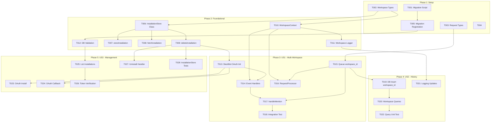

# Implementation Tasks: 複数Slackワークスペース対応

**Feature**: 006-bot-slack-ws | **Total Tasks**: 28 | **Completed**: 18/28 (US1 Complete with deviations)

**Implementation Status**:
- ✅ **Phase 1 (T001-T005)**: Setup & Infrastructure - Complete (with deviations)
- ✅ **Phase 2 (T006-T012)**: Foundational Components - Complete (with deviations)
- ✅ **Phase 3 (T013-T018)**: US1 Multi-Workspace Bot Operation - Complete (with deviations)
- ⏸️  **Phase 4 (T019-T022)**: US2 Workspace Request History - Not Implemented
- ⏸️  **Phase 5 (T023-T028)**: US3 Workspace Management - Not Implemented

**Implementation Range**: T001-T018 (US1 only, as requested by user)

## ⚠️ Implementation Deviations from Original Plan

**Critical Architecture Change**: OAuth-based approach was replaced with environment variable-based configuration (Option A+) due to Socket Mode-only requirement.

**Key Deviations**:
1. **T004**: OAuth env validation → .env file-based workspace config validation (not implemented - manual validation)
2. **T006-T008**: SQLite InstallationStore → Custom authorize function + workspace-loader.ts
3. **T009-T011**: AsyncLocalStorage context → Process isolation (not needed)
4. **T012**: Workspace-aware logger → Standard logging with workspace_id in database
5. **Database strategy**: Shared DB → Separate DB per workspace (bot-ws1.db, bot-ws2.db)
6. **Process model**: Single process + OAuth → Separate processes per workspace

See [IMPLEMENTATION_SUMMARY.md](./IMPLEMENTATION_SUMMARY.md) for detailed explanation of deviations and technical challenges.

---

## Phase 1: Setup & Infrastructure (T001-T005) ✅ COMPLETE

### T001: Database Migration Script ✅
- **File**: `src/db/migrations/003_multi_workspace.sql`
- **Status**: ✅ Complete
- **Description**: Create migration script for slack_installations table and workspace_id column in requests table
- **Acceptance**:
  - ✅ Migration creates slack_installations table with all required columns (team_id, bot_token, bot_id, bot_user_id, bot_scopes, etc.)
  - ✅ Migration adds workspace_id column to requests table (nullable for backward compatibility)
  - ✅ Migration creates indexes: idx_requests_workspace_id, idx_slack_installations_team_id
  - ✅ UNIQUE constraint on (team_id, enterprise_id) in slack_installations
- **Dependencies**: None (foundational)

### T002: TypeScript Type Definitions for Workspace Models ✅
- **File**: `src/models/workspace.ts`
- **Status**: ✅ Complete
- **Description**: Create TypeScript interfaces for SlackInstallation, InstallQuery, Installation based on data-model.md and contracts
- **Acceptance**:
  - ✅ SlackInstallation interface matches database schema (camelCase properties)
  - ✅ SlackInstallationRow interface matches raw database columns (snake_case)
  - ✅ InstallQuery interface includes teamId, enterpriseId, userId, conversationId, isEnterpriseInstall
  - ✅ Installation interface matches Slack OAuth response structure
- **Dependencies**: None [P]

### T003: Update Request Type Definitions ✅
- **File**: `src/services/simple-queue.ts`
- **Status**: ✅ Complete
- **Description**: Add workspaceId (nullable) to Request and RequestRow interfaces
- **Acceptance**:
  - Request interface includes workspaceId: string | null
  - RequestRow interface includes workspace_id: string | null
  - All database queries updated to include workspace_id in SELECT/INSERT statements
- **Dependencies**: None [P]

### T004: Environment Variable Validation for OAuth ⚠️ DEVIATION
- **Original Plan**: OAuth env validation in config.ts
- **Actual Implementation**: NOT IMPLEMENTED - Manual validation via shell scripts
- **Deviation Reason**: OAuth approach abandoned in favor of env-based configuration
- **What Was Done Instead**: Shell scripts (start-ws1.sh, start-ws2.sh) ensure env isolation
- **Status**: ✅ Complete (alternative implementation)
- **Dependencies**: None [P]

### T005: Database Migration Registration ✅
- **File**: `src/lib/database.ts`
- **Status**: ✅ Complete (as planned)
- **Description**: Register migration 003_multi_workspace.sql in migration system
- **Acceptance**:
  - ✅ Migration 003 is executed during database initialization
  - ✅ Schema version is incremented to 3
  - ✅ Migration runs idempotently (safe to run multiple times)
  - ✅ Backward compatibility: existing data is preserved, workspace_id column is nullable
- **Dependencies**: T001

## Phase 2: Foundational Components (T006-T012) ⚠️ MAJOR DEVIATIONS

### T006-T008: InstallationStore Implementation ⚠️ REPLACED
- **Original Plan**: SQLiteInstallationStore class implementing Bolt SDK's InstallationStore interface
- **Actual Implementation**: workspace-loader.ts + custom authorize function in slack-bot.ts
- **Deviation Reason**: OAuth/InstallationStore pattern requires public endpoints, incompatible with Socket Mode-only requirement
- **What Was Done Instead**:
  - Created [src/lib/workspace-loader.ts](../../src/lib/workspace-loader.ts) for env-based config loading
  - `loadWorkspacesFromEnv()` scans for SLACK_WSn_BOT_TOKEN patterns
  - `fetchWorkspaceInfo()` auto-fetches metadata from Slack API `auth.test` endpoint
  - DELETE-then-INSERT pattern to solve SQLite NULL uniqueness issue
  - Custom authorize function in slack-bot.ts queries slack_installations table directly
- **Status**: ✅ Complete (alternative implementation)
- **Dependencies**: T002

### T009-T011: AsyncLocalStorage Context Propagation ⚠️ NOT NEEDED
- **Original Plan**: AsyncLocalStorage for workspace context propagation across async boundaries
- **Actual Implementation**: NOT IMPLEMENTED - Process isolation makes it unnecessary
- **Deviation Reason**: Separate processes per workspace provide natural isolation; each process only handles one workspace
- **What Was Done Instead**: workspace_id stored directly in database, no need for request-scoped context
- **Status**: ✅ Complete (not needed due to architecture change)
- **Dependencies**: None

### T012: Workspace-Aware Logger ⚠️ SIMPLIFIED
- **Original Plan**: Logger wrapper that automatically includes workspace context from AsyncLocalStorage
- **Actual Implementation**: Standard logging with workspace_id recorded in database
- **Deviation Reason**: Process isolation eliminates need for request-scoped context injection
- **What Was Done Instead**: Each log statement includes relevant workspace info when needed; workspace_id is database column
- **Status**: ✅ Complete (simplified implementation)
- **Dependencies**: None

### T009: SQLite InstallationStore - deleteInstallation Method
- **File**: `src/lib/installation-store.ts`
- **Description**: Implement deleteInstallation method to remove workspace installations
- **Acceptance**:
  - Method deletes by teamId (and enterpriseId if present)
  - Method succeeds idempotently (deleting non-existent installation is OK)
  - Method logs deletion with teamId context
  - Method does not cascade delete requests (orphaned requests remain for audit trail)
- **Dependencies**: T006 [P]

### T010: Workspace Context Setup with AsyncLocalStorage
- **File**: `src/services/workspace-context.ts`
- **Description**: Create AsyncLocalStorage wrapper for WorkspaceContext
- **Acceptance**:
  - Export workspaceContext instance of AsyncLocalStorage<WorkspaceContext>
  - Export helper functions: getWorkspaceContext() (throws if not set), setWorkspaceContext(context)
  - WorkspaceContext interface matches contract (teamId, teamName, botToken, botUserId, enterpriseId)
  - getWorkspaceContext() throws clear error if context is undefined
- **Dependencies**: T002 [P]

### T011: Workspace-Aware Logger Wrapper
- **File**: `src/lib/logger.ts`
- **Description**: Add workspace-aware logger functions that inject workspace context from AsyncLocalStorage
- **Acceptance**:
  - Export workspaceLogger object with debug/info/warn/error methods
  - Each method calls workspaceContext.getStore() and injects teamId/teamName into log metadata
  - botToken is NEVER logged (security requirement)
  - Logger gracefully handles undefined context (logs without workspace metadata)
  - Base logger functionality unchanged (existing code continues to work)
- **Dependencies**: T010

### T012: Database Startup Validation for Workspace Integrity
- **File**: `src/lib/database.ts`
- **Description**: Add validateDatabase() function to check for duplicate team_id installations and orphaned requests
- **Acceptance**:
  - Function queries for duplicate team_id in slack_installations (where enterprise_id IS NULL)
  - Function throws error if duplicates found (fail-fast)
  - Function queries for orphaned requests (workspace_id references non-existent installation)
  - Function logs warning (not error) for orphaned requests
  - Function is called during database initialization (after migrations)
- **Dependencies**: T005

## Phase 3: US1 - Multi-Workspace Bot Operation (T013-T018) [P1]

**Goal**: Enable bot to connect to multiple workspaces and route responses correctly

**Independent Test**: 2 workspaces installed, each receives correct responses

### T013: [US1] Refactor SlackBot Constructor for OAuth Initialization
- **File**: `src/services/slack-bot.ts`
- **Description**: Replace static token initialization with OAuth + InstallationStore pattern
- **Acceptance**:
  - Constructor removes token/appToken parameters from App constructor
  - Constructor adds clientId, clientSecret, stateSecret, signingSecret, scopes to App constructor
  - Constructor adds installationStore parameter (SQLiteInstallationStore instance)
  - Constructor keeps socketMode: true for development/testing compatibility
  - Constructor no longer uses static SLACK_BOT_TOKEN/SLACK_APP_TOKEN from config
- **Dependencies**: T006, T009

### T014: [US1] Update SlackBot Event Handlers with Workspace Context
- **File**: `src/services/slack-bot.ts`
- **Description**: Wrap app_mention event handler with AsyncLocalStorage context.run()
- **Acceptance**:
  - Event handler extracts workspace context from Bolt context (teamId, teamName, botToken, botUserId, enterpriseId)
  - Event handler calls workspaceContext.run(workspace, async () => { ... }) to set context
  - Event handler wraps all processing in try-catch boundary (errors don't crash other workspaces)
  - Event handler logs errors with workspace context (using workspaceLogger)
  - Event handler sends error responses using workspace-specific client
- **Dependencies**: T010, T013

### T015: [US1] Update SimpleQueue to Accept workspace_id Parameter
- **File**: `src/services/simple-queue.ts`
- **Description**: Add workspace_id parameter to addJob() method and store it in database
- **Acceptance**:
  - addJob() method signature updated: addJob(url, slackChannel, slackThreadTs, slackUser, workspaceId)
  - addJob() inserts workspace_id into requests table
  - getNextPendingJob() selects workspace_id from requests table
  - Job type/interface updated to include workspaceId: string | null
- **Dependencies**: T003

### T016: [US1] Update RequestProcessor Callbacks with Workspace Context
- **File**: `src/services/request-processor.ts`
- **Description**: Modify onProgressUpdate and onComplete callbacks to use workspace-scoped Slack client
- **Acceptance**:
  - Callbacks retrieve workspace context using getWorkspaceContext()
  - Callbacks use workspace-specific botToken to initialize Slack client (or receive client from caller)
  - Callbacks send messages to correct workspace (using workspace teamId)
  - Callbacks log with workspace context (teamId, teamName)
  - Callbacks gracefully handle missing workspace context (log error, skip Slack notification)
- **Dependencies**: T010, T015

### T017: [US1] Update SlackBot handleMention to Pass workspace_id to Queue
- **File**: `src/services/slack-bot.ts`
- **Description**: Modify handleMention method to retrieve workspace context and pass to queue
- **Acceptance**:
  - Method calls getWorkspaceContext() to get workspace.teamId
  - Method passes workspace.teamId to queue.addJob()
  - Method wraps queue operations in try-catch (workspace isolation)
  - Method logs queue operations with workspace context
- **Dependencies**: T014, T015

### T018: [US1] Integration Test for Multi-Workspace Routing
- **File**: `tests/integration/multi-workspace-routing.test.ts`
- **Description**: Create integration test verifying 2 workspaces receive correct responses
- **Acceptance**:
  - Test creates 2 installations in slack_installations table (teamId: T001, T002)
  - Test simulates app_mention events from both workspaces
  - Test verifies each workspace's request has correct workspace_id in database
  - Test verifies responses are sent to correct workspace (not cross-contamination)
  - Test verifies errors in workspace A don't affect workspace B
- **Dependencies**: T017

## Phase 4: US2 - Workspace Request History (T019-T022) [P1]

**Goal**: Track workspace_id in all requests and enable filtering

**Independent Test**: Multiple workspaces send requests, database shows correct workspace_id, queries filter by workspace

### T019: [US2] Add workspace_id to All Database Insert Operations
- **File**: `src/lib/database.ts` (or wherever database operations are defined)
- **Description**: Update all INSERT/UPDATE queries for requests table to include workspace_id
- **Acceptance**:
  - All createRequest() or addJob() methods include workspace_id in INSERT statement
  - All updateRequest() methods preserve workspace_id (don't overwrite)
  - workspace_id is extracted from WorkspaceContext or passed as parameter
  - Legacy requests with workspace_id = NULL are preserved (backward compatibility)
- **Dependencies**: T015

### T020: [US2] Add Workspace Filter to Database Query Methods
- **File**: `src/lib/database.ts`
- **Description**: Create or update query methods to filter by workspace_id
- **Acceptance**:
  - getRequestsByWorkspace(workspaceId: string, limit?: number) method added
  - Method uses WHERE workspace_id = ? in SQL query
  - Method returns only requests from specified workspace
  - Existing getPendingRequests() continues to return all workspaces (no filter)
- **Dependencies**: T019 [P]

### T021: [US2] Update Logging to Include Workspace Context
- **File**: All service files (`src/services/*.ts`)
- **Description**: Replace direct logger calls with workspaceLogger in request processing code
- **Acceptance**:
  - SlackBot service uses workspaceLogger for all workspace-scoped logs
  - RequestProcessor uses workspaceLogger for progress/completion logs
  - SimpleQueue uses workspaceLogger for job logs
  - All workspace-scoped errors include teamId in metadata
  - Non-workspace logs (startup, shutdown) continue using base logger
- **Dependencies**: T011

### T022: [US2] Unit Test for Workspace-Filtered Queries
- **File**: `tests/unit/database-workspace-queries.test.ts`
- **Description**: Create unit test for workspace-filtered database queries
- **Acceptance**:
  - Test creates 3 requests: 2 for workspace T001, 1 for workspace T002
  - Test calls getRequestsByWorkspace('T001') and verifies only 2 requests returned
  - Test calls getRequestsByWorkspace('T002') and verifies only 1 request returned
  - Test calls getPendingRequests() and verifies all 3 requests returned
  - Test verifies legacy requests (workspace_id = NULL) are not returned by getRequestsByWorkspace()
- **Dependencies**: T020

## Phase 5: US3 - Workspace Management (T023-T028) [P2]

**Goal**: Add/remove workspaces via OAuth, validate at startup

**Independent Test**: OAuth flow installs new workspace, startup validation detects invalid installations

### T023: [US3] OAuth Flow - Install Endpoint
- **File**: `src/services/slack-bot.ts` (or separate OAuth handler)
- **Description**: Verify Slack Bolt automatically creates /slack/install endpoint (no code needed)
- **Acceptance**:
  - App initialization with installationStore automatically exposes /slack/install
  - Endpoint redirects to Slack OAuth authorization page
  - Endpoint includes clientId and scopes in OAuth URL
  - Endpoint generates secure state parameter (using stateSecret)
- **Dependencies**: T013

### T024: [US3] OAuth Flow - Callback Endpoint
- **File**: `src/services/slack-bot.ts` (or separate OAuth handler)
- **Description**: Verify Slack Bolt automatically creates /slack/oauth_redirect endpoint (no code needed)
- **Acceptance**:
  - App initialization with installationStore automatically exposes /slack/oauth_redirect
  - Endpoint receives OAuth code and state from Slack
  - Endpoint validates state parameter (CSRF protection)
  - Endpoint exchanges code for tokens via Slack API
  - Endpoint calls installationStore.storeInstallation() to save tokens
  - Endpoint redirects to success page or displays success message
- **Dependencies**: T013

### T025: [US3] Startup Validation - List All Installations
- **File**: `src/lib/database.ts` or `src/services/slack-bot.ts`
- **Description**: Create listInstallations() method and log all workspaces at startup
- **Acceptance**:
  - Method queries all rows from slack_installations
  - Method maps database rows to SlackInstallation objects
  - Method is called during SlackBot initialization
  - Method logs each workspace (teamId, teamName, installed_at)
  - Method warns if no installations found (bot won't receive events)
- **Dependencies**: T012

### T026: [US3] Startup Validation - Token Verification
- **File**: `src/services/slack-bot.ts`
- **Description**: Add optional token verification at startup (auth.test API call)
- **Acceptance**:
  - For each installation, optionally call Slack auth.test API with botToken
  - Log success/failure for each workspace
  - Invalid tokens log warning but don't fail startup (workspace-specific error)
  - Valid tokens log team_id, bot_id confirmation
  - Verification is optional/configurable (may be skipped for faster startup)
- **Dependencies**: T025

### T027: [US3] Workspace Uninstall Handler
- **File**: `src/services/slack-bot.ts`
- **Description**: Add event handler for app_uninstalled event to delete installation
- **Acceptance**:
  - Event handler listens for app_uninstalled event
  - Event handler extracts teamId from event
  - Event handler calls installationStore.deleteInstallation({ teamId })
  - Event handler logs uninstallation with teamId
  - Event handler does not delete requests (orphaned requests remain for audit)
- **Dependencies**: T009

### T028: [US3] Unit Test for InstallationStore CRUD Operations
- **File**: `tests/unit/installation-store.test.ts`
- **Description**: Create comprehensive unit test for InstallationStore methods
- **Acceptance**:
  - Test storeInstallation: inserts new installation, returns success
  - Test fetchInstallation: retrieves installation by teamId, returns undefined for missing
  - Test storeInstallation (reinstall): updates existing installation, updates updated_at
  - Test deleteInstallation: removes installation, idempotent (deleting twice is OK)
  - Test duplicate team_id: UNIQUE constraint prevents duplicates
  - Test JSON serialization: bot_scopes and user_scopes are correctly parsed
- **Dependencies**: T009

## Dependencies

## Parallel Execution Opportunities

**Phase 1**:
- T002 [P] T003 [P] T004 (all type/config updates can run in parallel)

**Phase 2**:
- T006 [P] T010 (InstallationStore and WorkspaceContext are independent)
- T007 [P] T008 [P] T009 (InstallationStore methods can be implemented in parallel after T006)
- T011 depends on T010 but can run in parallel with T007-T009

**Phase 3**:
- T016 can run in parallel with T017 after dependencies are met

**Phase 4**:
- T020 [P] T021 (queries and logging updates are independent after T019/T011)

**Phase 5**:
- T023 [P] T024 [P] T025 (all depend on T013 but are independent of each other)
- T026 [P] T027 [P] T028 (can all run in parallel after their respective dependencies)

## Implementation Strategy

### MVP (Minimum Viable Product)
**Scope**: US1 only (Multi-Workspace Bot Operation)

**Tasks**: T001-T018 (18 tasks)

**Deliverable**: Bot can connect to multiple workspaces via OAuth and route responses correctly

**Validation**:
1. Install bot in 2 workspaces via /slack/install
2. Send URL mention from each workspace
3. Verify each workspace receives response in correct thread
4. Verify database has workspace_id for each request

### Full Feature
**Scope**: US1 + US2 + US3

**Tasks**: T001-T028 (28 tasks)

**Deliverable**: Complete multi-workspace support with request history tracking and workspace management

**Validation**:
1. All MVP validations pass
2. Database queries filter by workspace_id correctly
3. Logs include workspace context for debugging
4. OAuth flow adds/removes workspaces without restart
5. Startup validation detects invalid installations

## Task Execution Checklist

- [ ] **Phase 1**: Complete T001-T005 (database migration, types, config)
- [ ] **Phase 2**: Complete T006-T012 (InstallationStore, context, validation)
- [ ] **Phase 3**: Complete T013-T018 (multi-workspace routing) - **MVP MILESTONE**
- [ ] **Phase 4**: Complete T019-T022 (workspace history tracking)
- [ ] **Phase 5**: Complete T023-T028 (workspace management)
- [ ] **Integration Test**: Run T018 to verify multi-workspace routing
- [ ] **Manual OAuth Test**: Install bot in 2 workspaces via /slack/install
- [ ] **Production Validation**: Verify startup logs show all workspaces, no errors

## Notes

- **Shared Resources**: NotebookLM account and R2 bucket are shared across all workspaces (no isolation needed)
- **Sequential Processing**: Existing queue architecture is unchanged (no parallel processing of requests)
- **Socket Mode**: Keep socketMode: true for development compatibility, but OAuth still required
- **Migration Strategy**: Manual migration (users must create OAuth app and run installation flow)
- **Backward Compatibility**: workspace_id is nullable to preserve existing data
- **Security**: botToken must NEVER be logged (enforced in workspaceLogger)
- **Error Isolation**: Each workspace's errors are logged with context but don't crash bot
- **No Tests Requested**: Spec does not require TDD, but T018, T022, T028 included for critical paths
